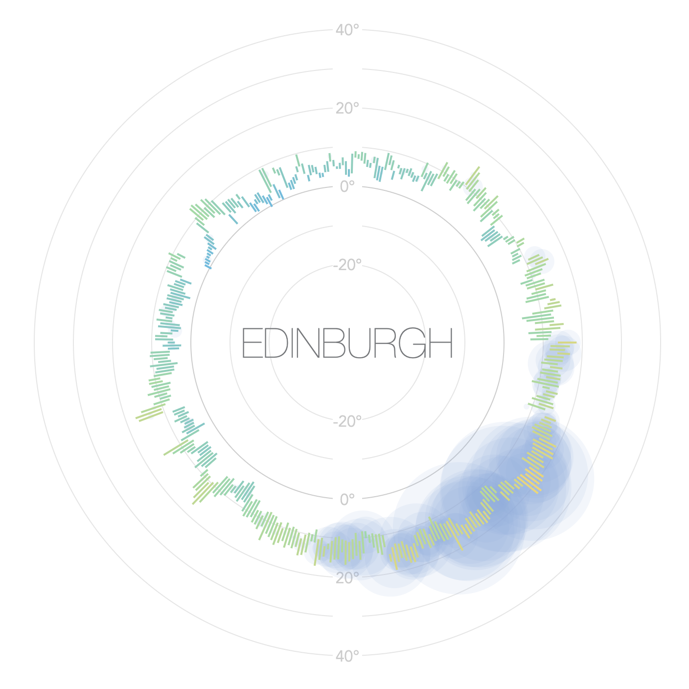

# Weather Dial Generator

There's a super cool poster called [Weather Radials](http://www.weather-radials.com/), which is a visualization I've long wanted to make for other places I've lived in. However, getting the data can be pretty tricky, so I've taken the opportunity here to make a little tool. The intention is that you generate a chart for a place, then copy the generated SVG into an image editing tool and compose your own poster.



## Setting up

You will need to sign up for a free API key at https://stormglass.io/. There is an API key included in the project, but it good for only 50 requests a day, and generating the chart takes 36 of them :(

Then (using Node 10):

```sh
npm install
REACT_APP_STORMGLASS_TOKEN=your-api-token-here npm start
```

This will install dependencies and run the app locally.

## Testing and building for production

You can run the unit tests with:

```sh
npm test
```

and the integration tests with:

```sh
npm run test:integration
```

You can build the production assets with:

```sh
REACT_APP_STORMGLASS_TOKEN=your-api-token-here npm run build
```
